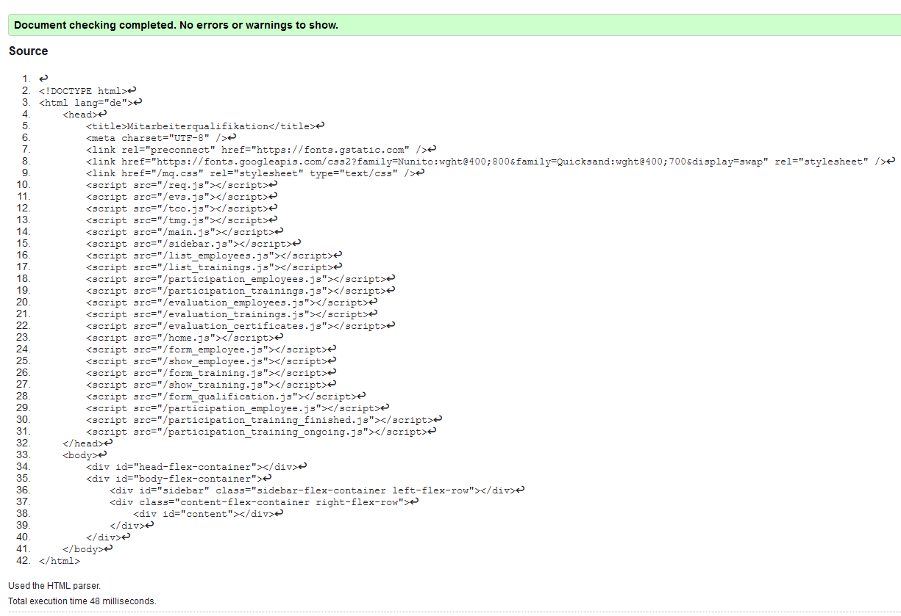
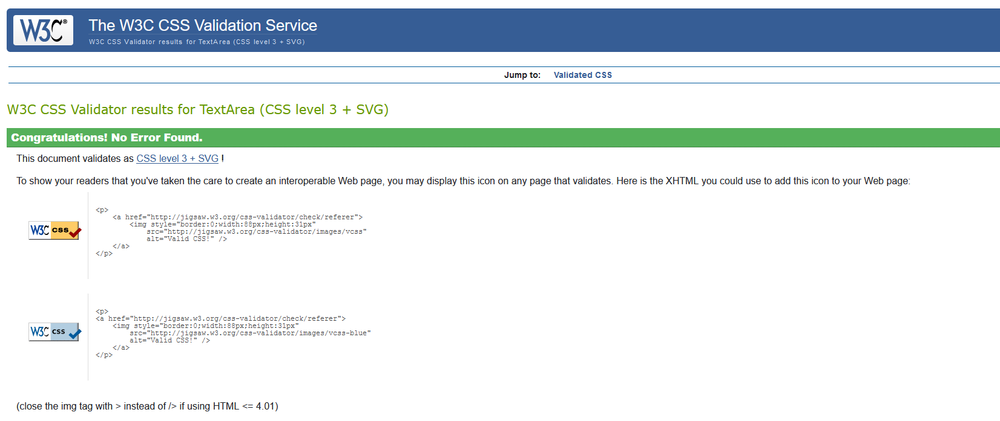

---
title: Mitarbeiterqualifikation-Doku
...

Dieses Projekt wurde von Marina Inokuchi (Matr-Nr. 1287686) bearbeitet. Letztes Bearbeitungsdatum: 02.02.2021.

# 1. Dateistruktur #

Die Webanwendung besteht aus folgenden Dateien (Ordner werden kursiv dargestellt):

- server.py
- access.log
- server.log
- server.conf
- *app*
  - application.py
  - database.py
  - dataid.py
  - template.py
  - dateutils.py
- *content*
  - index.html
  - mq.css
  - evs.js
  - req.js
  - tco.js
  - tmg.js
  - evaluation_certificates.js
  - evaluation_employees.js
  - evaluation_trainings.js
  - form_employee.js
  - form_qualification.js
  - form_training.js
  - home.js
  - list_employees.js
  - list_trainings.js
  - main.js
  - participation_emplyoee.js
  - participation_employees.js
  - participation_training_finished.js
  - participation_training_ongoing.js
  - participation_trainings.js
  - show_employee.js
  - show_training.js
  - sidebar.js
- *data*
  - *employees*
    - diverse Mitarbeiter-Dateien (.json)
  - *trainings*
    - diverse Weiterbildungs-Dateien (.json)
- *templates*
  - evaluation_certificates.html
  - evaluation_employees.html
  - evaluation_trainings.html
  - form_employee.html
  - form_qualification.html
  - form_training.html
  - header.html
  - home.html
  - list_employees.html
  - list_trainings.html
  - participation_employee.html
  - participation_employees.html
  - participation_training_finished.html
  - participation_training_ongoing.html
  - participation_trainings.html
  - show_employee.html
  - show_training.html
  - sidebar.html

# 2. Beschreibung der Lösung #

## 2.1. Aufgabe der Anwendung ##

Die Aufgabe der Anwendung ist es, die Teilnahme von mehreren Mitarbeitern an verschiedenen Weiterbildungen zu organisieren. Zusätzlich sollen auch Zertifikate und Qualifikationen, die aus erfolgreichen Teilnahmen an den Weiterbildungen resultieren, den Mitarbeitern zugeordnet werden können.

## 2.2. Übersicht der fachlichen Funktionen ##

### 2.2.1. Erfassen/Ändern von Daten ###

Um dieses Ziel zu erreichen, können zunächst sowohl Mitarbeiter als auch Weiterbildungen erfasst werden.
Mitarbeiter werden mit folgenden Angaben erfasst:

- Name
- Vorname
- Akademische Grade
- Tätigkeit

Weiterbildungen werden mit folgenden Angaben erfasst:

- Bezeichnung
- Von
- Bis
- Beschreibung
- maximale Teilnehmeranzahl
- minimale Teilnehmeranzahl
- Haupt-Qualifikation
- Zertifikat (optional)

Nach dem ersten Speichern einer Weiterbildung können weitere Qualifikationen erfasst werden, indem man in der Übersicht, die über den Menü-Eintrag "Pflege Weiterbildungen" erreichbar ist, auf "ändern" klickt und dann auf "weitere Qualifikationen erfassen".

Alle eingegeben Daten, sowohl Mitarbeiter- als auch Weiterbildungsdaten, sind nachträglich über den Button "ändern" editierbar. Außerdem kann man Mitarbeiter und Weiterbildungen mit Klick auf einen Button "löschen" wieder aus dem Datenbestand entfernen. Für die Löschung ist eine erneute Bestätigung des Benutzers erforderlich.

#### 2.2.2. Teilnahmen an Weiterbildungen erfassen/ändern ####

Unter dem Menüpunkt "Teilnahme" sind folgende Funktionalitäten möglich:

- bei *zukünftigen* Weiterbildungen können Mitarbeiter zu den Weiterbildungen angemeldet werden (Menüpunkt "Sichtweise Mitarbeiter")
- bei *laufenden* Weiterbildungen kann die Teilnahme von einzelnen Teilnehmern storniert werden (Menüpunkt "Sichtweise Weiterbildungen")
- bei bereits *abgeschlossenen* Weiterbildungen kann eine Teilnahme als "erfolgreich" oder "nicht erfolgreich" eingestuft werden (Menüpunkt "Sichtweise Weiterbildungen")

### 2.2.3. Auswertungen ###

Schließlich werden unter dem Menüpunkt "Auswertungen" nach Kategorien unterteilte Listen angezeigt.

- unter dem Punkt "Mitarbeiter" wird eine alphabetisch sortierte Liste von Mitarbeitern ausgegeben, zusammen mit den jeweiligen Teilnahmen an Weiterbildungen und deren Teilnahmestatus
- unter dem Punkt "Weiterbildungen" wird eine alphabetisch sortierte Liste von allen Weiterbildungen ausgegeben, jeweils mit allen erfolgreichen Teilnehmern
- unter dem Punkt "Zertifikate" wird eine alphabetisch sortierte Liste aller Zeritifkate angezeigt und jeweils alle Mitarbeiter, die dieses Zertifikat besitzen

# 3. Beschreibung der Komponenten des Servers #

## 3.1. server.py ##

### 3.1.1. Zweck ###

Der Einstiegspunkt bei Serverstart befindet sich in der Datei "server.py". Hier werden alle Konfigurationen vorgenommen und der Server wird gestartet.

### 3.1.2. Aufbau ###

Es gibt eine große main-Methode, in der alle nötigen Konfigurationen und die Verzeichnisstruktur festgelegt werden. In der main-Methode wird u.a. auch eingestellt, dass zwei Logfiles angelegt und laufend gepflegt werden:
- "access.log", in der alle HTTP Requests gespeichert werden
- "server.log", in der alle sonstigen Log-Ausgaben gespeichert werden, z.B. wann der Server gestartet wurde und auch wann Fehler auftraten inkl. Fehlerdetails

### 3.1.3. Zusammenwirken mit anderen Komponenten ###

Diese Klasse interagiert mit anderen Komponenten dadurch, dass die Verzeichnisstruktur hier bestimmt wird. Die Pfad-Angaben von anderen Klassen und Dateien werden dadurch von der "server.py" beeinflusst. Außerdem werden hier die zwei MethodDispatcher (je einer für die Klasse "Application" und einer für die Klasse "Template") erstellt, die für die REST-Schnittstelle des Servers benötigt werden.

## 3.2. application.py ##

### 3.2.1. Zweck ###

Steuerung der serverseitigen Verarbeitung und Bereitstellung der REST-Schnittstelle. Alle öffentlichen Methoden befinden sich in der "application.py" und daher wird jede Benutzeranfrage zunächst durch die "application.py" entgegengenommen und von dort aus an die "database.py" weitergeleitet.

### 3.2.2. Aufbau ###

Die "application.py" initialisiert zunächst das Datenbank-Objekt ("database.py").
Dann stellt sie die 4 Methoden der REST-Schnittstelle öffentlich bereit, die alle Benutzeranfragen an den Server entgegennehmen.

### 3.2.3. Zusammenwirken mit anderen Komponenten ###

Die "application.py" interagiert ausschließlich mit der "database.py", indem es anhand der vorliegenden Parameter entscheidet, was für ein Ziel der Client mit der gesendeten Anfrage erreichen will und dann die entsprechende Methode der "database.py" aufruft.

// ------------------------------------------------------------------------------------------------------------------------ hier weiter

### 3.2.4. API ###

Indem man folgendes Attribut in der Klasse "Application" festlegt, werden alle Methoden der Klasse öffentlich und somit als Schnittstelle verfügbar gemacht:

    exposed = True

## 3.3. database.py ##

### 3.3.1. Zweck ###

Diese Klasse ist für die Verwaltung der Daten zuständig, d.h. zum Speichern von neuen Einträgen, zum Abändern und Löschen bereits bestehender Einträge und auch zum Zusammenstellen von temporären Daten, die nur der Anzeige dienen.

### 3.3.2. Aufbau ###

Zu Beginn wird jeweils ein Validator und ein DataId-Objekt initialisiert und jeweils ein Objekt für die Mitarbeiter- und die Weiterbildungs-Daten. Die Daten werden bei der Initialisierung einmalig aus den Ordnern *data/employees* und *data/trainings* ausgelesen und im weiteren Verlauf nur noch in die genannten Verzeichnisse zurückgeschrieben.

### 3.3.3. Zusammenwirken mit anderen Komponenten ###

Die "database.py" wird ausschließlich von der "application.py" aufgerufen, für die sie dann Daten bereitstellt, entweder direkt aus den in den beiden "employee_data" oder "training_data" Objekten oder auch Daten, die erst nach vorgegebenen Kriterien berechnet werden. Zum Beispiel für die Auswertungen werden die Auslieferungsdaten immer aufgrund der aktuellen Datenlage erneut berechnet und danach sofort wieder verworfen.

### 3.3.4. API ###

Nahezu alle Methoden sind als Schnittstelle für die "application.py" vorgesehen. Die Ausnahmen bilden die jeweils zwei Methoden zum Einlesen und zum Schreiben der JSON-Dateien.

## 3.4. dataid.py ##

### 3.4.1. Zweck ###

Diese Klasse berechnet mithilfe des Moduls *uuid* immer eine neue, einzigartige uuid4 und gibt diese an die aufrufende Umgebung zurück.

### 3.4.2. Aufbau ###

Diese Klasse stellt lediglich eine Methode zur Verfügung, um eine neue UUID zu generieren und diese zurückzugeben.

### 3.4.3. Zusammenwirken mit anderen Komponenten ###

Die "dataid.py" wird nur von der "database.py" aus aufgerufen, wenn ein neuer Eintrag gespeichert werden soll.

### 3.4.4. API ###

Die Methode *create_new_id()* stellt die Schnittstelle für andere Klassen, in diesem Fall für die "database.py" dar.

## 3.5. dateutils.py ##

### 3.5.1. Zweck ###

Diese Klasse stellt Hilfsmethoden zur Datums-Verarbeitung bereit.

### 3.5.2. Aufbau ###

Bei Objekterzeugung wird das Attribut "today" mit dem aktuellen Tag initialisiert. Außerdem gibt es eine Methode, die aus einem als String vorliegendem Datum ein *datetime*-Objekt erzeugt.

### 3.5.3. Zusammenwirken mit anderen Komponenten ###

Die DateUtils-Klasse ruft ihrerseits nur builtin Klassen von Python auf, sie ist lediglich eine Hilfs-Klasse für die "database.py" mit den vorgenannten Methoden.

### 3.5.4. API ###

Die einzige Methoden in dieser Klasse stellt die Schnittstelle für andere Klassen dar.

## 3.6. template.py ##

### 3.6.1. Zweck ###

Diese Klasse stellt eine öffentliche GET-Methode bereit, deren Ziel es ist, alle Templates zu bündeln und auf einmal bei Applikationsstart auszuliefern.

### 3.6.2. Aufbau ###

Diese Klasse besteht aus einem leeren Konstruktor und der oben bereits genannten GET-Methode

### 3.6.3. Zusammenwirken mit anderen Komponenten ###

Diese Klasse interagiert nur einmalig bei Applikations-Start mit dem Client. Mit anderen serverseitigen Klassen interagiert sie nicht.

### 3.6.4. API ###

Die einzige Methoden in dieser Klasse stellt die Schnittstelle für den Client dar (GET).

# 4. Datenablage #

Die Datenablage wurde mit folgenden 2 Verzeichnissen und jeweils 0 bis n untergeordneten JSON-Dateien umgesetzt:

- *data/employees*
- *data/trainings*

Für jeden einzelnen Mitarbeiter sowie für jede einzelne Weiterbildung werden einzelne *.json*-Dateien im jeweiligen Ordner angelegt. Sowohl ein Mitarbeiter als auch eine Weiterbildung haben eine eindeutige ID (uuid4).

Jeder Mitarbeiter hat darüber hinaus ein dict (Python-Datentyp: dictionary), in dem 0 bis n ID's von Weiterbildungen hinterlegt werden können mit dem dazugehörigen Teilnahmestatus als String. Die ID ist jeweils der Schlüssel und der Teilnahmestatus der dazugehörige Wert.

Jede Weiterbildung hat jeweils eine Liste für die Qualifikationen (1 bis n) und eine für das Zertifikat (0 oder 1).

Weitere Daten werden nicht gespeichert, denn weitere benötigte Daten, wie z.B. die Zuordnung von Zertifikaten und Qualifikationen zu einem Mitarbeiter werden in Echtzeit aus den vorgenannten Daten generiert. So wird die Komplexität der Datenstruktur minimiert und das Risiko, bei einer Änderung der Daten an einer Stelle die Änderung an anderer Stelle fehlerhafterweise zu vergessen, minimiert.

Ebenso werden Sortierungen (z.B. nach dem Alphabet) in Echtzeit vorgenommen. Diese Sortierung spiegelt sich nicht in der Datengrundlage wider.

# 5. Konfiguration #

In der "server.py" wird das Root-Verzeichnis als das Verzeichnis festgelegt, in dem sich auch die "server.py" befindet. Außerdem wird das Objekt "Application" aus der "application.py" an das Verzeichnis */app* gemountet und ein MethodDispatcher für diese Klasse erstellt. Der MethodDispatcher sorgt dafür, dass GET-, POST-, DELETE- und PUT-Requests des Clients bei der richtigen Methode (bzw. überhaupt am Server) ankommen.

Auch für die "template.py"-Klasse wird ein MethodDispatcher erstellt und die Klasse wird an das Verzeichnis */templates* gemountet.

Darüber hinaus legt die Zeile

    cherrypy.config.update({'log.access_file': "access.log", 'log.error_file': "server.log", 'log.screen': True, })

fest, dass zwei Logfiles angelegt werden, die kontinuierlich gepflegt werden solange der Server gestartet ist.

# 6. Durchführung und Ergebnis der geforderten Prüfungen #

## 6.1. Überprüfung des HTMLs ##

Um die Korrektheit der HTML-Seiten zu überprüfen, wurde der Seitenquelltext von jeder einzelnen Unterseite in das Eingabefeld der Seite [The W3C Markup Validation Service](https://validator.w3.org/#validate_by_input) rein kopiert und das Ergebnis dann für vereinzelte Korrekturen an den Templates benutzt. Nun sieht das Ergebnis jeder einzelnen Unterseite wie folgt aus:

## 6.2. Überprüfung des CSS ##

Um die Korrektheit des CSS zu überprüfen, wurde die "mq.css" Datei in das Eingabefeld der Seite [The W3C CSS Validation Service](http://jigsaw.w3.org/css-validator/#validate_by_input) kopiert. Das Ergebnis zeigte keine Fehler an und das daraus resultierende Icon ist in der Webseite mit eingebunden:

